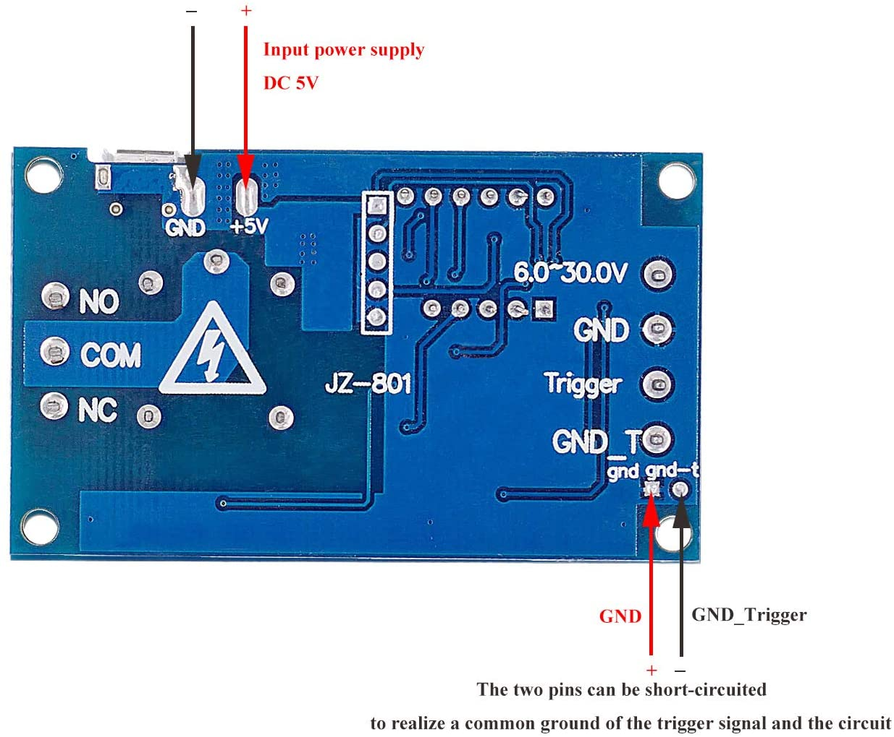

# Darkroom Timer

This code implements a darkroom timer supporting test-strip mode and f-stop increments using these cheap
"timer relay" modules:

  

Note that it should be this exact module (there are variations with different number of digits in the display
and number of buttons. Even for this same board, there are at least two variations based on different MCUs.
This code targets the one with an STC8 MCU (the other one include a similar Nuvotron chip). To distinguish
them, look in the underside and confirm that it has four (not five) programming pads:

  

This is *not* the supported board:

  

# Flashing

You will need a standard USB-serial dongle and connect the bottom three of the four pads (RX, TX and GND) and
use [this fork](https://github.com/protobits/stcgal/tree/stc8h1k08-fix) of stcgal flashing tool, which contains
a necessary fix to flash the STC8H1K08 MCU. 

The MCU runs a bootloader right after powerup and when stcgal is run, it will wait for the bootloader to indicate
its pressence. Thus, first connect the USB serial dongle, run stcgal, and then power the module (via the USB
connector, for instance). To flash, use the following command:

    stcgal.py -b 115200 -P stc8 build/firmware.ihx

Once flashed succesfully, you no longer need to follow this procedure as the firmware itself will go into the 
bootloader once it detects the pulse data sent by stcgal. Moreover, it is configured to do so at the higher
115200 baud rate, so you will need to run stcgal like this:

    stcgal.py -l 115200 -b 115200 -P stc8 build/firmware.ihx

# Usage

TODO
